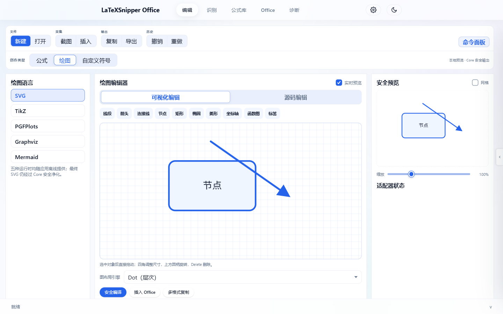
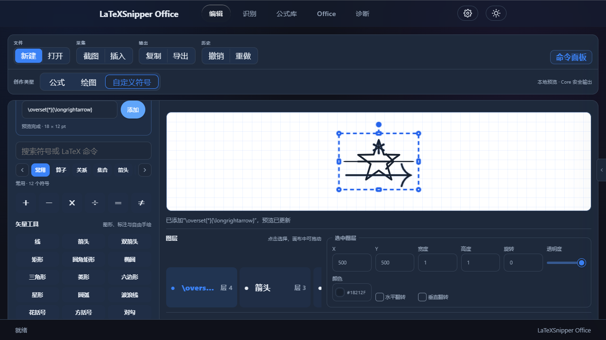

# LaTeXSnipper Office

独立的 LaTeX 公式编辑器和插入工具，支持 Office (OLE/VSTO)、Obsidian、WPS、VS Code、浏览器等多平台。


## 界面与工作流

应用按任务划分为五个稳定工作区：**编辑**用于公式与绘图创作，**识别**管理截图、图片和 PDF 识别任务，**公式库**统一历史与收藏，**Office**展示当前宿主和可用插入路线，**诊断**集中呈现 Core、执行后端、Office 桥接、OLE 与截图权限证据。全局设置独立于工作区，并按设备、平台和宿主作用域保存。

编辑工作区采用“资源—编辑/预览—插入与导出”三栏布局，支持浅色/深色主题和窄窗口导航。公式可导出为 LaTeX、MathML、Typst、SVG、PNG、PDF 或 OMML；绘图工作区提供可视化编辑、源码编辑、安全编译、实时预览和 Office 插入。SVG、TikZ、PGFPlots、Graphviz 与 Mermaid 运行时随应用离线提供，不需要用户另装编译器。当前生产插入路线是经过 Core 消毒的 SVG 经 Native Office VSTO 写入 Word、Excel 或 PowerPoint；Native Shapes、Drawing OLE、PNG 与打印 PDF 保留为版本化契约能力，在对应宿主实现和 readiness 证据齐备前不会宣称可用。

### 离线绘图与实时预览



可视化画布提供线段、箭头、连接线、节点、基础图形、坐标轴、函数图与标签工具。对象可直接拖动，四角自由调整宽高，边中点单独调整宽度或高度，`Shift` 等比缩放，上方圆柄旋转；编辑网格与控制柄只属于界面层，不会写入最终 SVG 或 Office 插入内容。

### 自定义符号合成



自定义符号可以组合内置数学符号、任意 LaTeX 图层、矢量图元和自由路径，并独立设置每层位置、宽高、旋转、颜色、透明度与层级。目录支持搜索、分类滚动与翻页；点击画布空白或按 `Esc` 会取消当前选择，但不会删除图层。保存、复制和跨设备传输前仍由 Core 校验冻结合同与 SVG 安全策略。

## 技术栈

| 层级 | 技术 | 说明 |
|------|------|------|
| 核心逻辑 | Rust | 高性能、内存安全 |
| 桌面容器 | Tauri 2.0 | 跨平台桌面应用 |
| 前端 UI | HTML/CSS/JavaScript | Vite 构建 |
| 公式编辑 | MathLive | WYSIWYG 编辑器 |
| 公式渲染 | MathJax | LaTeX 转 SVG/MathML |
| Office 集成 | OLE + VSTO | Word/Excel/PowerPoint 原生公式对象；Visio 矢量 shape（Beta） |
| Office 集成 | Web Add-in | Office.js 加载项 |

## 平台支持

| 平台 | 桌面版 | 插件 |
|------|--------|------|
| Windows | ✅ MSI/EXE | OLE 公式对象 + VSTO |
| macOS | ✅ DMG | — |
| Linux | ✅ DEB/RPM | — |
| Obsidian | — | ✅ 社区插件 |
| WPS | — | ✅ 加载项 |
| VS Code | — | ✅ 扩展 (.vsix) |
| Chrome/Edge | — | ✅ 浏览器扩展 |
| Firefox | — | ✅ 浏览器扩展 |

## 功能特性

- **公式编辑**: MathLive WYSIWYG 编辑器，支持实时预览
- **公式库**: 2100+ 预置公式，18 个分类
- **多种输出格式**: LaTeX、MathML、SVG、PNG、OMML
- **Office OLE 公式对象**: 双击编辑，持久嵌入，原生 Word/Excel/PowerPoint 支持
- **Office 宿主感知**: 运行时权限与真实宿主能力共同决定 OMML、OLE、SVG 或 PNG 路线
- **离线绘图适配器**: SVG、TikZ、PGFPlots、Graphviz 与 Mermaid 随应用提供并支持实时预览；最终 SVG 必须通过 Core 安全校验才能插入
- **自定义符号**: 组合 96+ 内置符号、任意 LaTeX 图层、15 类矢量工具与自由路径，支持图层、颜色、宽高和旋转编辑
- **诊断与质量证据**: Provider 验证、ORT/模型状态、质量基线和脱敏失败样本
- **字体处理**: 自定义字体样式、颜色、缩放
- **跨平台**: 一套代码多端运行

## 项目结构

```
LaTeXSnipper-Office/
├── src-tauri/                        # Rust 后端 (Tauri)
│   ├── src/
│   │   ├── commands/                 # Tauri IPC 命令
│   │   ├── core/                     # 公式转换引擎
│   │   └── platforms/                # 平台集成 (Office OLE 编辑等)
│   ├── Cargo.toml
│   └── tauri.conf.json
├── src/                              # 前端代码 (Vite)
│   ├── index.html
│   ├── main.js                       # 主应用逻辑
│   └── styles/main.css
├── apps/
│   ├── browser-extension/            # Chrome/Firefox 扩展
│   ├── desktop/                      # 桌面端配置
│   ├── mobile/                       # 移动端 (Capacitor)
│   ├── native-office/                # Office VSTO + OLE 公式对象
│   │   ├── LaTeXSnipper.Word/        # Word 插件
│   │   ├── LaTeXSnipper.Excel/       # Excel 插件
│   │   ├── LaTeXSnipper.PowerPoint/  # PowerPoint 插件
│   │   ├── LaTeXSnipper.Visio/       # Visio Native VSTO（Beta）
│   │   ├── LaTeXSnipper.Shared/      # 共享库
│   │   ├── LaTeXSnipper.OleFormulaObjectNative/  # OLE DLL (C++)
│   │   └── Installer/                # WiX 安装器
│   ├── obsidian-plugin/              # Obsidian 插件
│   ├── office-addin/                 # Office Web Add-in
│   ├── vscode-extension/             # VS Code 扩展
│   └── wps/                          # WPS 加载项
├── core-protocol/                    # 核心协议 (TypeScript)
├── shared/                           # 共享模块
├── modules/                          # 模块化组件
├── scripts/                          # 构建/工具脚本
├── docs/                             # 文档
├── tests/                            # 测试
├── .github/workflows/                # CI/CD
├── package.json
└── vite.config.js
```

## 安装指南

完整的手动安装、插件部署和故障排查说明：

[Manual Installation Guide](docs/MANUAL_INSTALLATION.md)

内容包括：

- Windows Desktop 安装
- Word / Excel / PowerPoint Native Office (OLE + VSTO) 与 Visio Native vector VSTO（Beta）
- Office.js Web Add-in
- Obsidian Plugin
- WPS Plugin
- VS Code Extension
- Chrome / Edge / Firefox Extension
- 卸载与故障排查

### 安装依赖

```bash
# 安装 Node.js 依赖
npm install

# 安装 Rust (如果需要构建原生组件)
curl --proto '=https' --tlsv1.2 -sSf https://sh.rustup.rs | sh
```

### 开发

```bash
# 启动前端开发服务器 (端口 2100)
npm run dev:vite

# 启动完整 Tauri 桌面应用
cargo tauri dev
```

### 构建

```bash
# 构建前端
npm run build:vite

# 构建桌面版 (MSI + EXE)
cargo tauri build

# 构建 Office VSTO 插件 + OLE DLL
cd apps/native-office/Installer
./build.ps1 -Configuration Release
```

### CI/CD

通过 GitHub Actions 自动构建：

```bash
# 推送 tag 触发完整构建
git tag v1.2.2
git push origin v1.2.2
```

构建产物自动上传到 GitHub Release。

## Office 集成

### OLE 公式对象

- 双击打开 LaTeXSnipper 编辑器
- 支持 Word/Excel/PowerPoint
- 32 位和 64 位 Office 兼容
- 公式数据持久化在文档中

### VSTO 加载项

- Word: 行内/显示/编号公式
- Excel: 单元格公式
- PowerPoint: 幻灯片公式
- Visio: SVG 优先、PNG fallback 的公式 shape（Beta；OLE Experimental/unavailable）

### Office 插入能力矩阵

`VSTO` 是 Windows Office 的宿主集成路径，不是文档中的第四种对象格式。

| 宿主 | 原生 OMML | 图片（SVG/PNG） | 可编辑 OLE | VSTO 宿主路径 |
|------|-----------|-----------------|------------|---------------|
| Word | ✅ | ✅ | ✅ | ✅ |
| PowerPoint | 不适用 | ✅ | ✅ | ✅ |
| Excel | 不适用 | ✅ | ✅ | ✅ |

PowerPoint 和 Excel 不提供 Word 原生 OMML 对象模型，因此使用图片或嵌入式 OLE；三种宿主都经过项目自身适配器的真实插入和重新读取验证。可直接下载并人工检查的 Word、PowerPoint、Excel 样例、预览截图与高风险公式清单见 [Office 人工验收样例](docs/manual-acceptance-samples/README.md)。其中包含箭头、极限、分段函数、积分/求和上下限、编号右括号、极长/极高公式，以及最高 32 层嵌套积分。

## 发布

Release 页面包含：

| 文件 | 说明 |
|------|------|
| `LaTeXSnipper-Desktop-Windows-x64.msi` | Windows 桌面安装包 |
| `LaTeXSnipper-Desktop-Windows-x64-Setup.exe` | Windows NSIS 备用安装包 |
| `LaTeXSnipper-Office-VSTO_*.zip` | VSTO 手动部署包 |
| `LaTeXSnipper-Obsidian_*.zip` | Obsidian 插件 |
| `LaTeXSnipper-WPS_*.zip` | WPS 加载项 |
| `LaTeXSnipper-VSCode_*.vsix` | VS Code 扩展 |
| `LaTeXSnipper-Browser-Chrome_*.zip` | Chrome 扩展 |
| `LaTeXSnipper-Browser-Firefox_*.zip` | Firefox 扩展 |
| `*.dmg` | macOS 安装包 |
| `*.deb` / `*.rpm` | Linux 安装包 |
| `SHA256SUMS.txt` | 校验文件 |

## 许可证

GNU Affero General Public License v3.0 (AGPL-3.0-only)

本项目采用 AGPL-3.0 许可证。商业使用、修改和分发须遵守 AGPL-3.0 的源代码提供义务。需要不同授权安排请联系项目维护者。
