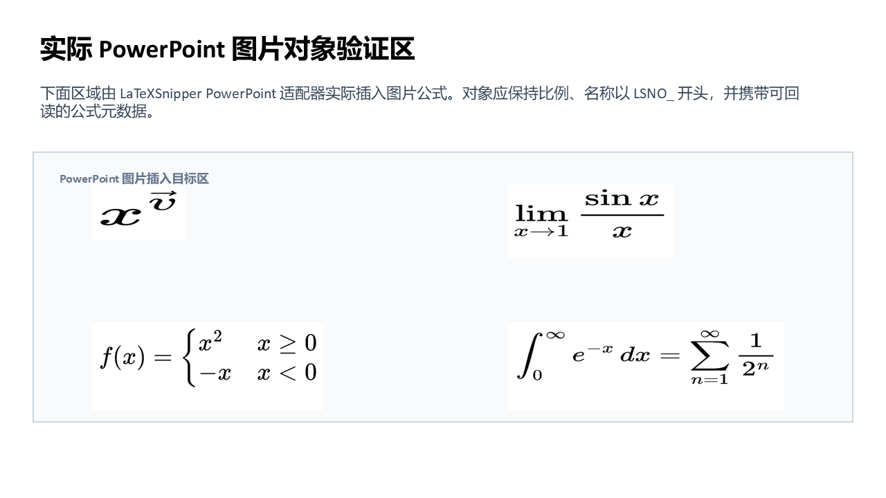
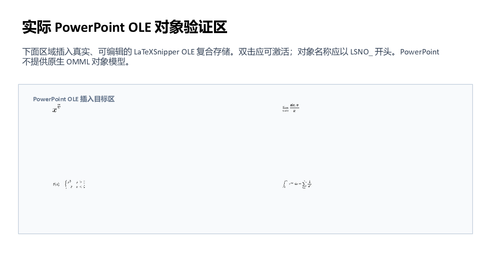
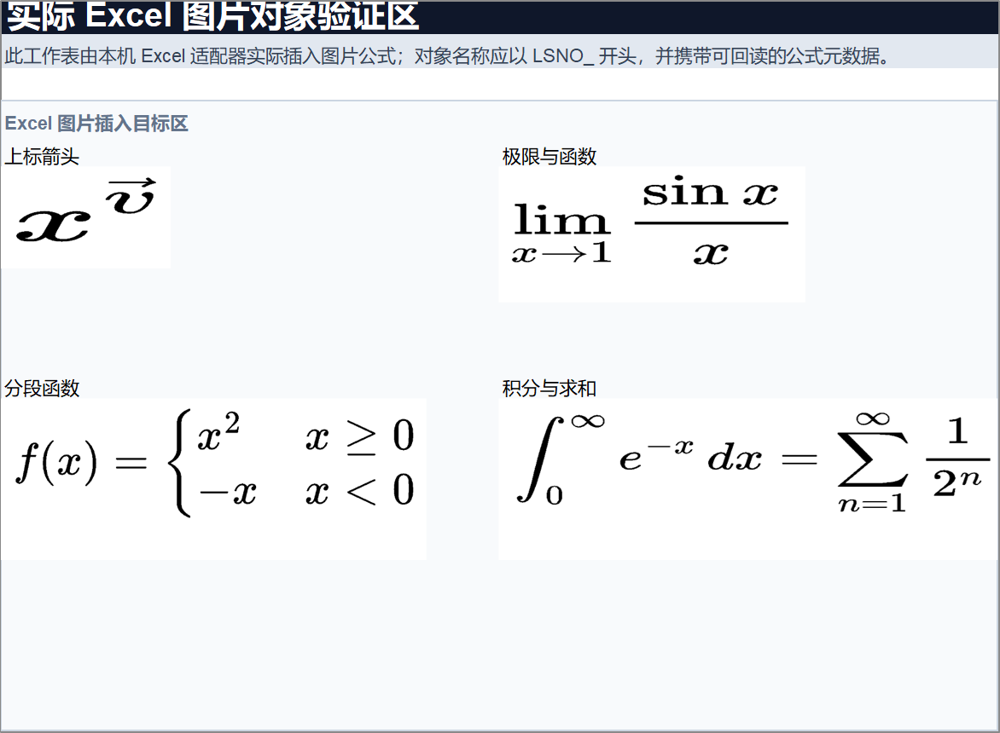
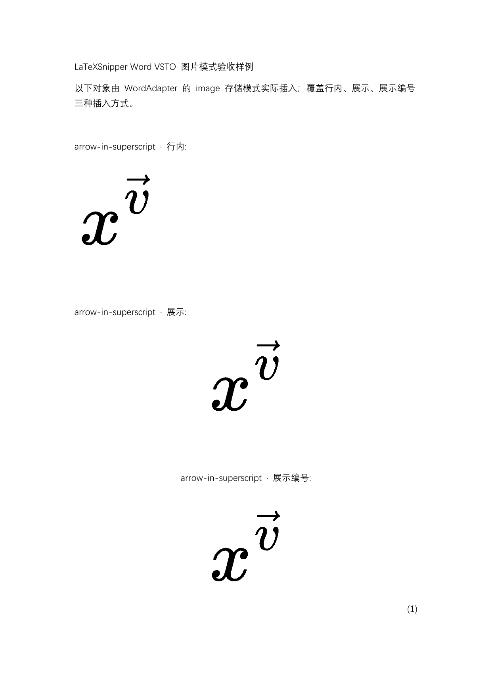

# Office 人工验收样例

本目录集中保存可直接用 Microsoft Office 打开的验收文件，便于发布前由开发者、测试人员和用户检查真实显示效果。

## 文件说明

| 文件 | 宿主与插入方式 | 覆盖范围 |
| --- | --- | --- |
| `LaTeXSnipper-Word-Native-OMML.docx` | Word 原生 OMML | 26 组公式，每组包含行内、独立行、带编号独立行；含箭头、极限、积分、求和、矩阵、分段函数以及 4/8/16/32 层嵌套积分 |
| `LaTeXSnipper-Word-VSTO-Image.docx` | Word VSTO 图片模式 | 4 组高风险公式，每组由 `WordAdapter` 实际插入行内、独立行、带编号独立行，共 12 个图片公式；编号域结果为 `(1)` 至 `(4)` |
| `LaTeXSnipper-Word-Editable-OLE.docx` | Word 可编辑 OLE | 上标箭头、极限、分段函数、积分/求和、32 项极长公式、12 层极高分式；每组包含行内、独立行、带编号独立行 |
| `LaTeXSnipper-PowerPoint-VSTO-Image-OLE.pptx` | PowerPoint VSTO 图片 + 可编辑 OLE | 结构验收矩阵、极长/极高公式，以及由 PowerPoint 适配器实际插入的 4 个图片对象和 4 个真实嵌入 OLE 对象 |
| `LaTeXSnipper-Excel-VSTO-Image-OLE.xlsx` | Excel VSTO 图片 + 可编辑 OLE | 结构验收矩阵、人工结论栏，以及由 Excel 适配器实际插入的 4 个图片对象和 4 个真实嵌入 OLE 对象 |

`VSTO` 是 Windows Office 的宿主集成路径，不是第四种文档存储格式。能力矩阵如下：

| 宿主 | 原生 OMML | 图片 | OLE | VSTO 宿主路径 |
| --- | --- | --- | --- | --- |
| Word | 支持 | 支持 | 支持 | 支持 |
| PowerPoint | 不适用（宿主没有 Word 原生 OMML 对象模型） | 支持 | 支持 | 支持 |
| Excel | 不适用（宿主没有 Word 原生 OMML 对象模型） | 支持 | 支持 | 支持 |

PowerPoint 与 Excel 的图片对象名称均以 `LSNO_` 开头并携带公式元数据；图片页不是把截图预先贴进模板，而是经过项目自身 VSTO 宿主适配器插入、保存并重新计数验证的结果。两份文件的 OLE 页各包含 4 个可由 Office 枚举的真实复合文档对象，名称以 `LSNO_PERSISTED_` 开头。Excel 会拒绝 Word 剪贴板直接提供的自定义 OLE 格式，因此验收生成链先在 PowerPoint 中持久化同一个 LaTeXSnipper OLE，再复制到 Excel；最终工作簿内仍是嵌入 OLE，不是图片替身。

## 重点检查项

1. 上标箭头应位于字符正上方，不应出现方框或水平偏移。
2. `lim` 的趋近条件应位于运算符下方，`\sin x` 中间不应出现缺字方框。
3. 分段函数左大括号应完整，两行之间不应出现方框或丢失符号。
4. 积分、求和的上下限应完整保留，主体与运算符不应重叠。
5. 带编号公式的右括号必须完整；更新 Word 全部域后，同一文档中的编号应依次为 `(1)`、`(2)`、`(3)`，而不是全部保持 `(1)`。
6. 极长与极高公式应等比缩放，不应裁切左右边缘、顶部或底部。
7. 所有可见说明统一使用简体中文；按钮和对象说明不应出现中英文混排。

## 嵌套深度说明

当前转换链没有声明一个面向用户的固定“最大嵌套层数”。本轮真实 Word 验收已通过 32 层嵌套积分，极高公式验收已通过 12 层嵌套分式。更深结构的实际边界取决于公式复杂度、Office 版面尺寸和宿主资源，不应把 `32` 理解为硬编码上限。

## 实际宿主预览

PowerPoint：

Excel：

Word：

